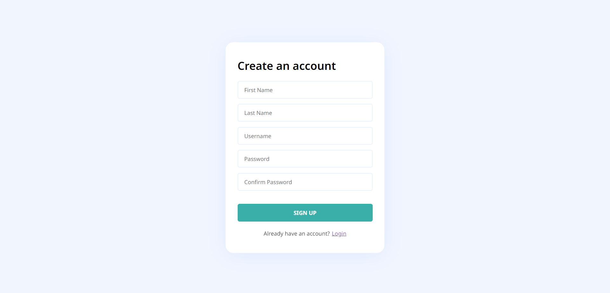
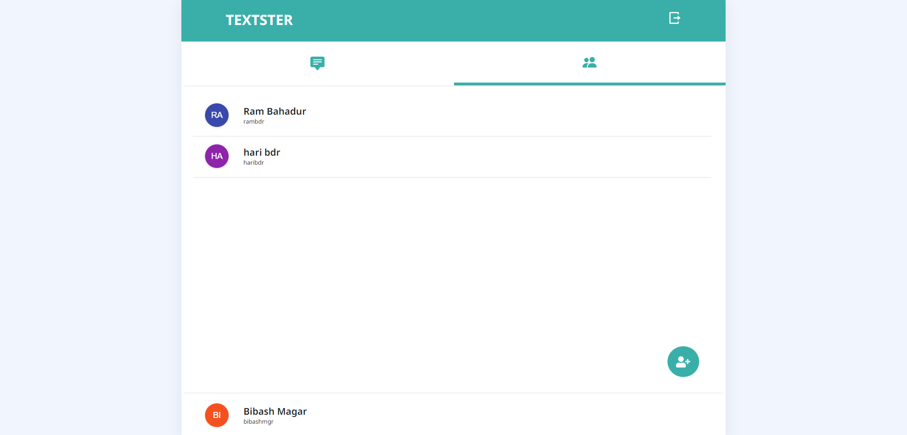

## Textster

A simple chat app that enables a private text-based messaging function between two people.

### Features:
- This app only allows conversation between two users.
- A user can add another user by entering his/her username.

